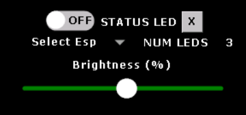

# IoT-HomeAutomation-ESP32

IoT Home Automation system using ESP32s to control various peripherals, developed with amazing help and under supervision of Alex Risos from Risos Enterprises for my summer 2024-25 internship. This project comes with pre-made examples of peripherals, but the esp32-Receiver-Firmware can be flashed and easily modified on any ESP32 for any custom functionality. There are 2 versions of the project, read the Known Issues section to see why.

<table align="center">
  <tr>
    <th style="text-align:center;">Simplified (Recommended)</th>
    <th style="text-align:center;">Full</th>
  </tr>
  <tr>
    <td align="center"></td>
    <td align="center"></td>
  </tr>
</table>

## Demo Video (Simplified Version)

This demo covers the linking and usage of the esp32-SSR, esp32-LED-strip, esp32-Motion-Sensor, and esp32-Temp-Sensor. I linked them all onto one switch for demonstration purposes, but you could obviously link them to other switches. The SSR isn't hooked up to anything, but it is rated for any 100-240VAC load. With just this bare bones setup, you could automate many things, like activating some LED night lights when motion is detected, setting off an emergency alarm when the temperature sensor triggers, turning on a light bulb when entering a room, etc. 

## Summary of features
* Detection and pairing with powered ESPs that have the receiver firmware programmed
* Link any paired ESP to any of 8 switches on nextion display, can link multiple ESPs on one switch
* Control of 2-channel low-level solid state relays
* Quadruple state switches with actions of A, B, A+B or OFF
* Control of LED strips (Status-LED which shows a colour dependant on Gpu Temperature, and LED-Strip for colour picking using RGB sliders on nextion GUI)
* Trigger switches using a Motion Sensor
* Trigger switches using a Temperature Sensor
* Trigger switches and/or enable sensors with a scheduler
* 2 Camera slots for image captures (Not in simplified version)
* Weather information with adjustable time range
* Tide extremes and current tide height information (Not in simplified version)
* CPU Temperature, GPU Temperature, Ram Usage and Power consumption shown on nextion display as waveforms
* Music player
* Lock PC button

## How to Use
### Getting started
1. Flash esp32-HW-monitor on central esp32-s3
2. Flash as many receiver esps as you would like
3. Connect COM port of esp32-s3 to a USB port on your computer (See wiring diagram)
4. Flash whichever .HMI file (simplified or full) in nextion-HMI onto the nextion 
5. Make sure the esp32-s3 and the nextion share a common ground
6. Start the ArduinoWeatherHardwareMonitor desktop app, make sure to run as admin. For quick setup with no TideAPI functionality, execute ArduinoWeatherHardwaremonitor_RELEASE/SerialSender.exe. If you want Tide functionality, you must add your API key to the Secret_PLACEHOLDER.cs file, and recompile the project in Visual Studio.
7. Select the appropriate serial port by right clicking the tray icon

At this point, the waveforms and weather information should have loaded on the main page, the LOCKPC button and the music player should be working. Right click the tray icon to select your WinAmp installation folder and your music folder. You will only have to do this once, unless you change your WinAmp path or your music folder. The music player plays MP3, MIDI, MOD, MPEG-1, AAC, M4A, FLAC, WAV, WMA, Ogg Vorbis.

### General Information
I have included all the specific hardware/sensors/parts I used for all the different peripherals under Wiring Diagrams. You can definitely use different hardware, but you will likely have to modify some code in the peripheral projects.

All peripheral projects have EspIDs in their main.cpp files. You can change the names of these to anything you want. E.g. "living room lights", "garage motion sensor", etc.

In settings, you can click directly on any numbers to bring up a on-screen numerical keyboard, and press the <strong>X</strong> to clear selections. You should always hit <strong>APPLY</strong> after changing any settings to keep the system up to date and accurate to what is shown on the settings page.

### Linking and Turning Peripherals on/off

Can be used for esp32 or esp8266, just flash the appropriate receiver firmware.

<table align="center">
  <tr>
    <td>

    <ol>
      <li>Press <strong>SETTINGS</strong>, then <strong>SCANESPS</strong> in the top left. Wait a couple of seconds for the peripherals to connect.</li>
      <li>Link a switch to any peripheral and hit <strong>APPLY</strong> on the bottom left.</li>
      <li>Exit back to the main page. You should now be able to turn that peripheral on/off using the switch you selected.</li>
    </ol>
    
Each switch has 4 states which go in sequence of ONA, ONAB, ONB, OFF. This allows each peripheral to handle 2 different actions, A and B, where ONAB is turning on both at the same time. This synergizes with usage of 2 channel SSRs, as seen in esp32-SSR. 
 
For the standard esp32/esp8266-Receiver-Firmware, all three ON states will just turn the builtin LED on, but this can be easily modified.

  
</td>
    <td align="center">

  

    

      <h4>Linking Switches</h4>
      
    

    

      <h4>4 Switch States in order</h4>
      
    

  

</td>
  </tr>
</table>

### Solid State Relays
Link to a switch in settings, and press the switch on the main screen to turn on whatever channel(s) you want. 

### Temperature Sensor

<table align="center">
  <tr>
    <td>

    <ol>
      <li><strong>Select ESP</strong>: The device that is connected to the temperature sensor</li>
      <li><strong>Select SW</strong>: The Switch that should be triggered when the temperature exceeds the trigger temperature</li>
      <li><strong>Channel selection</strong>: Which channel of the switch should be turned on (A, B, AB)</li>
      <li><strong>Trigger SW at</strong>: The temperature threshold, in celcius, where anything that exceeds it will trigger the connected switch</li>
      <li><strong>Hysterisis</strong>: What percentage of the trigger temperature does the measured temperature need to fall below in order to turn the switch off. E.g., if trigger temp is 50C, and hystersis is 50%, when triggered, the measured temperature must fall below 25C in order for the switch to turn off automatically.</li>
    </ol>
    
After selecting these settings, you must hit <strong>APPLY</strong> and navigate back to the main screen, and press <strong>TEMP EN</strong> to enable the sensor to make automatic changes. If it any point you wish to override the sensor/ignore it, just press <strong>TEMP EN</strong> again to disable it.

  
</td>
    <td align="center">

  

    

      <h4>Temperature Sensor</h4>
      
    

  

</td>
  </tr>
</table>

### Motion Sensor

<table align="center">
  <tr>
    <td>

    <ol>
      <li><strong>Select ESP</strong>: The device that is connected to the motion sensor</li>
      <li><strong>Select SW</strong>: The Switch that should be triggered when motion is detected</li>
      <li><strong>Channel selection</strong>: Which channel of the switch should be turned on (A, B, AB)</li>
      <li><strong>Timeout</strong>: How long the switch stays on after motion is detected, before turning off. 0 minutes will default to 1 second.</li>
    </ol>
    
After selecting these settings, you must hit <strong>APPLY</strong> and navigate back to the main screen, and press <strong>MOTION EN</strong> to enable the sensor to make automatic changes. If it any point you wish to override the sensor/ignore it, just press <strong>MOTION EN</strong> again to disable it.

  
</td>
    <td align="center">

  

    

      <h4>Motion Sensor</h4>
      
    

  

</td>
  </tr>
</table>

### Scheduler
Make sure the desktop app is open, and the serial port to the central esp is connected.

<table align="center">
  <tr>
    <td>

    <ol>
      <li><strong>Select SW</strong>: The Switch that should be turned on at Start time, and off at End time</li>
      <li><strong>Channel selection</strong>: Which channel of the switch should be turned on/off (A, B, AB)</li>
      <li><strong>Start</strong>: Turn selected switch on at this time</li>
      <li><strong>End</strong>: Turn selected switch off at this time</li>
      <li><strong>X</strong>: Will unschedule the switch</li>
    </ol>
    
For the temperature and motion sensors, the scheduler will turn the <strong>TEMP EN</strong> and <strong>MOTION EN</strong> on/off instead. For this case, the channel selection is not needed, and hence is ignored.

  
</td>
    <td align="center">

  

    

      <h4>Scheduler</h4>
      
    

  

</td>
  </tr>
</table>

### LED Strip

<table align="center">
  <tr>
    <td>

    <ol>
      <li><strong>Select ESP</strong>: The device that is connected to the LED Strip</li>
      <li><strong>NUM LEDS</strong>: How many LEDs to show.</li>
      <li><strong>Link</strong>: You must then link the LED Strip device to a switch in order to turn it on.</li>
      <li><strong>Colour</strong>: Change the colour of the LED Strip using the 3 RGB sliders on the main screen.</li>
    </ol>
  
</td>
    <td align="center">

  

    

      <h4>LED Strip</h4>
      
    

    

      <h4>Link LED Strip</h4>
      
    

  

</td>
  </tr>
</table>

### Status LED Strip

<table align="center">
  <tr>
    <td>

    <ol>
      <li><strong>Select ESP</strong>: The device that is connected to the LED Strip</li>
      <li><strong>NUM LEDS</strong>: How many LEDs to show.</li>
      <li><strong>Turn On</strong>: Apply the settings first, then turn the strip on and off using the switch.</li>
      <li><strong>Brightness</strong>: Use the slider to change the brightness of the LED strip.</li>
    </ol>
    
Currently, the status LED strip just reports the GPU temperature scaled from 30 to 100 degrees celcius to the CHSV colour scale, where 100C is red, and 30C is aqua, with everything else in between. You can modify this in the sendTempData task in HW-monitor, and the receiver_espnow in Status-LED to add whatever else you want it to report.

    
Also note that the ON/OFF switch and the brightness slider do not require hitting <strong>APPLY</strong> to take action.

  
</td>
    <td align="center">

  

    

      <h4>Status LED Strip</h4>
      
    

</td>
  </tr>
</table>

### Weather Settings
<table align="center">
  <tr>
    <td>

    <ol>
      <li><strong>Lat & Long</strong>: Standard Lat Long, + for North of equator, + for East of Prime Meridian</li>
      <li><strong>Delta Hours</strong>: Time gap between each weather forecast. E.g. delta hour of 6 will give a forecast of now, +6h, +12h, +18h in the main screen.</li>
      <li>Hit <strong>APPLY</strong>, It will take a couple seconds for the weather icons to be updated.</li> 
    </ol>
    
Note that the weather is automatically updated every 5 minutes. Pressing <strong>APPLY</strong> manually fetches new data.

  
</td>
    <td align="center">

  

    

      <h4>Weather Settings</h4>
      
    

  

</td>
  </tr>
</table>

## Wiring Diagrams

### Nextion and Central ESP
* Nextion - NX1060P101-011C-I, RX of Nextion to pin 17, TX of Nextion to pin 18
* ESP32-S3 - Connect USB Port on the ESP to the PC
* SD Card in Nextion if using ESP-CAMs, otherwise not necessary
* Make sure ESP shares common ground with Nextion and the PSU

  

### Temperature Sensor
* ESP32 - data line from sensor connected to GPIO pin 26.
* DHT22 - 3.3V VCC
* 1 KOhm Resistor - Make sure to add a pull-up resistor between data and VCC for stable transmission (see official DHT22 documentation).

  

### Motion Sensor
* ESP32 - Data line on PIR sensor to pin 13
* PIR Sensor - HC-SR501, 5V VCC

  

### LED Strip & Status LED Strip
* ESP32 - Primary data line of LED Strip connected to pin 26
* LED Strip - WS2815 12V LED Strip 
* I have 19 LEDs on my LED strip, but you should change that definition to however many LEDs you have in the main file of the esp32-LED-strip project.

  

### Solid State Relays
* ESP32
* SSR - G3MB-202P 2-channel low-level, 5V DC input, 240VAC 2A output
* Channels 1 and 2 are controlled by esp32 pins 27 and 26 respectively. 

  

## Known Issues
* Camera capture is very slow, around 10-15 seconds just for a single still image, and during this all buttons are unresponsive. It "works", but is generally pretty unusable, and hence has been disabled. It can easily be enabled by uncommenting code in the setup() function in the main file of HW-Monitor and filling in secret files in the HW-Monitor and CAM projects for WiFi SSID and Password.
* Tide data is also excluded in the simplified version, as the API used for the data (Stormglass.io) is unstable and could likely get rid of their free tier pricing. If stormglass is still free when reading this, or you have a paid api key, you can simply uncomment the task in the setup() function in the main file of HW-Monitor where the tasks are created, and provide your api key in the secret file in the ArduinoHardwareWeatherMonitor C# app.
* Make sure to select the serial port in the desktop app first, and then configure any settings with the receiver ESPs. Doing it the other way causes problems with the central ESP's memory and will result in unstable behaviour.

## Thank You
Alex Risos for supervising this project and always providing amazing guidance, help, and feedback. Definitely would not have been able to complete this project without his help.  